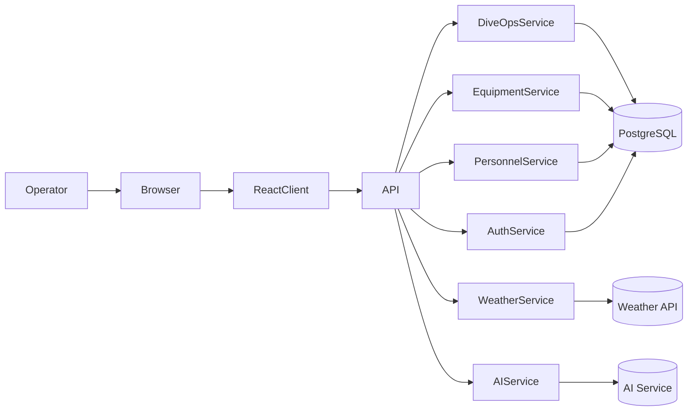
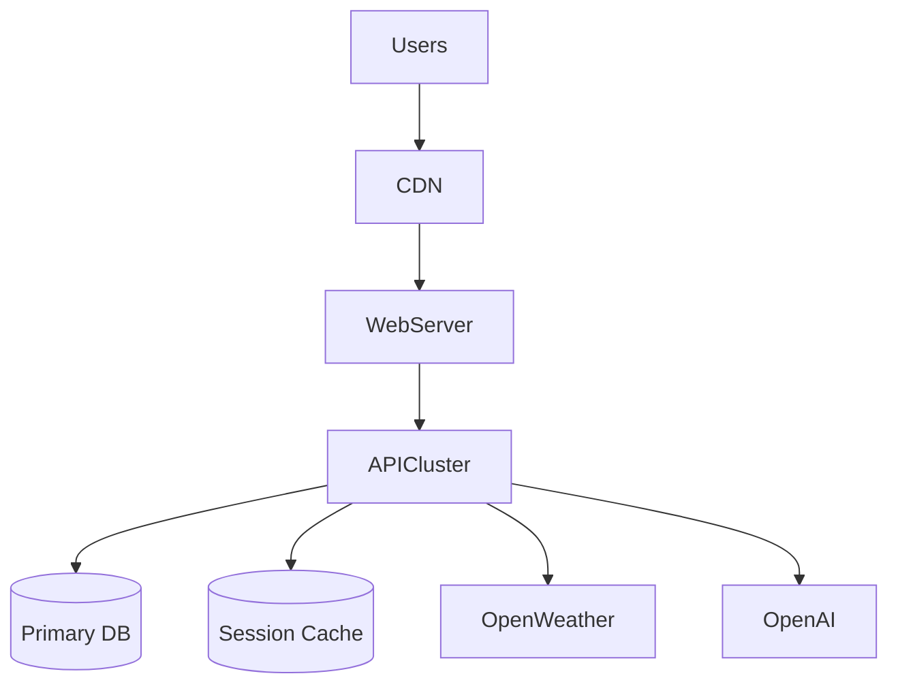
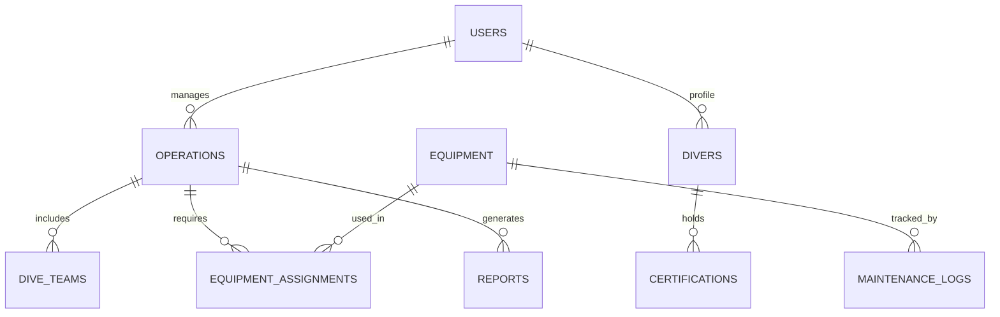

# DiveOps

<div align="center">

**Operational Command Platform for Commercial Diving Teams**

DiveOps transforms dive operations into a **real-time digital command center** for subsea workforces.

---


</div>

---

# Why DiveOps Exists

Commercial diving operations operate in **high-risk, coordination-heavy environments** where operational clarity directly impacts safety and mission success.

Most dive teams still rely on:

* spreadsheets
* whiteboards
* paper dive logs
* disconnected tools

These workflows create serious problems:

• fragmented operational awareness
• lost operational history
• difficult compliance reporting
• limited decision support
• poor equipment traceability

DiveOps replaces these with a **centralized digital operational backbone** for subsea teams.

The long-term vision is to build the **operating system for subsea operations worldwide.**

---

# Platform Capabilities

## Dive Operations Management

* Dive mission planning
* Operational scheduling
* Vessel coordination
* Dive team assignment
* Mission tracking dashboards

## Personnel Management

* Diver credential tracking
* Medical clearance tracking
* Crew availability management
* Certification verification

## Equipment Operations

* Equipment inventory tracking
* Equipment assignment to missions
* Maintenance tracking
* Operational readiness status

## Environmental Intelligence

* Weather forecasts
* Dive condition awareness
* Environmental planning insights

## Operational Reporting

* Dive logs
* Post-operation reports
* Equipment usage reports
* Operational summaries

## AI Operational Assistant

DiveOps integrates AI tools to assist operations teams.

Capabilities include:

* automated report summaries
* operational insights
* documentation assistance
* structured operational analysis

---

# Platform Architecture

## High-Level System Architecture



---

# Deployment Architecture



---

# Observability Stack

DiveOps includes a production-grade monitoring stack.

| Component      | Tool               |
| -------------- | ------------------ |
| Logging        | Pino               |
| Metrics        | Prometheus         |
| Visualization  | Grafana            |
| Error Tracking | Sentry             |
| Health Checks  | Express middleware |

---

# C4 Architecture Model

## System Context

```mermaid
C4Context
title DiveOps System Context

Person(diver, Diver)
Person(supervisor, Dive Supervisor)

System(diveops, DiveOps Platform)

System_Ext(weather, Weather API)
System_Ext(ai, AI Services)

diver -> diveops
supervisor -> diveops

diveops -> weather
diveops -> ai
```

---

## Container Diagram

```mermaid
C4Container
title DiveOps Containers

Person(user, Dive Operator)

System_Boundary(diveops, DiveOps) {

Container(web, Web Client, React + Vite)
Container(api, API Server, Node + Express)
ContainerDb(db, PostgreSQL Database)

}

user -> web
web -> api
api -> db
```

---

# Database Model



---

# API Documentation

All endpoints return **JSON**.

Base URL:

```
/api
```

---

## Authentication

```
POST /api/auth/login
POST /api/auth/logout
GET  /api/auth/session
```

---

## Divers

```
GET /api/divers
POST /api/divers
GET /api/divers/:id
PUT /api/divers/:id
```

---

## Equipment

```
GET /api/equipment
POST /api/equipment
PUT /api/equipment/:id
```

---

## Operations

```
GET /api/operations
POST /api/operations
GET /api/operations/:id
PUT /api/operations/:id
```

---

## Weather

```
GET /api/weather/current
GET /api/weather/forecast
```

---

# Example API Request

Create a new dive operation:

```bash
curl -X POST http://localhost:5000/api/operations \
-H "Content-Type: application/json" \
-d '{
 "location":"Port Fourchon",
 "date":"2026-04-12",
 "teamSize":5
}'
```

---

# Screenshots

## Operations Dashboard


---

## Dive Mission Planning


---

## Equipment Management


---

## Operational Reports


---

# Technology Stack

### Frontend

* React 19
* Vite
* Tailwind CSS
* Radix UI
* TanStack Query
* Recharts

### Backend

* Node.js
* Express
* TypeScript
* Passport authentication
* Pino logging

### Database

* PostgreSQL
* Drizzle ORM

### Integrations

* OpenAI
* OpenWeather API
* Azure Blob Storage

### Testing

* Vitest
* Supertest

---

# Local Development

Clone repository:

```bash
git clone https://github.com/spittman-maker/DiveOps-MVP.git
cd DiveOps-MVP
```

Install dependencies:

```
npm install
```

Create environment configuration:

```
cp .env.example .env
```

Run development servers:

```
npm run dev
npm run dev:client
```

Application will run at:

```
http://localhost:5000
```

---

# Testing

Run full test suite:

```
npm run test
```

Run coverage:

```
npm run test:coverage
```

---

# Deployment

DiveOps supports multiple deployment models:

* Docker
* AWS ECS
* Kubernetes
* VPS deployments

Example:

```
docker build -t diveops .
docker run -p 5000:5000 diveops
```

---

# Roadmap

Planned platform expansions include:

• mobile dive operations app
• dive computer integrations
• fleet & vessel management
• predictive equipment maintenance
• regulatory compliance automation
• AI operational copilots
• subsea analytics platform

---

# Organization

**Precision Subsea Group LLC**

Commercial diving technology platform.

---

# License

MIT
