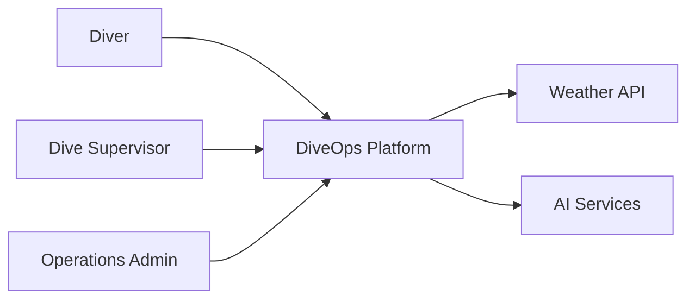
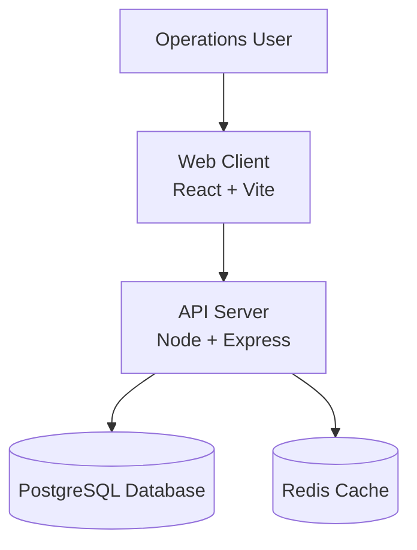
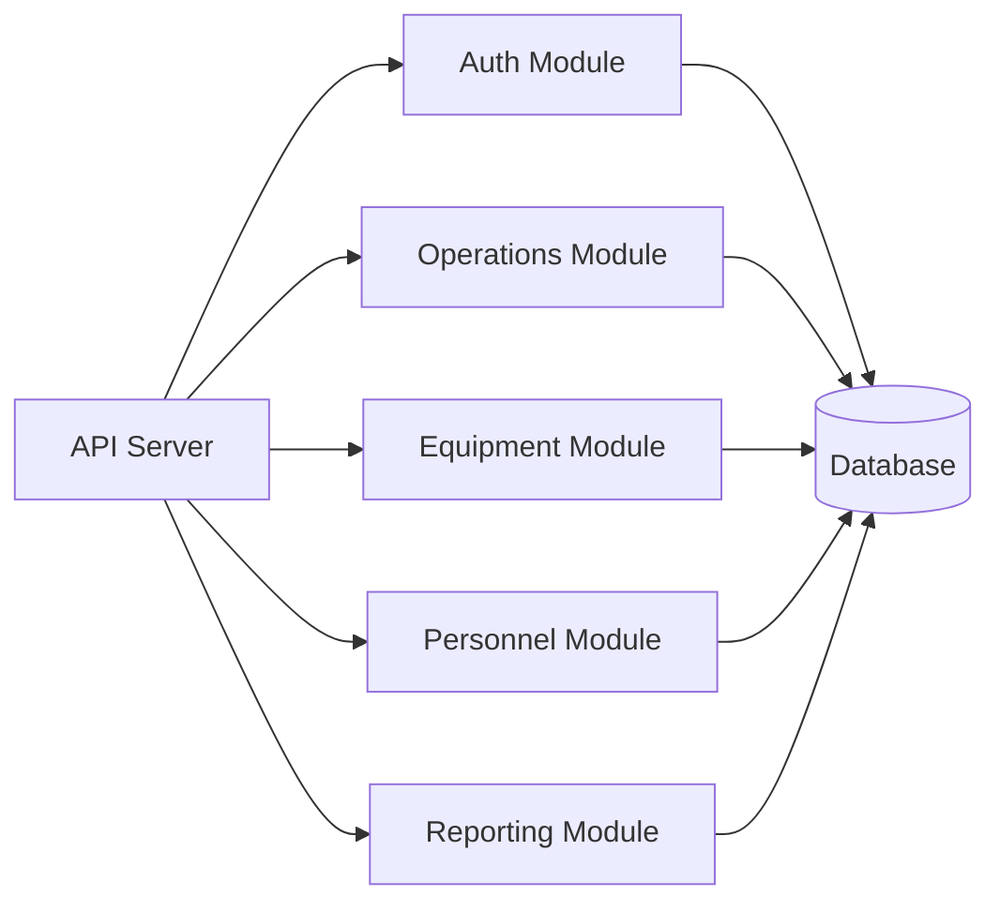
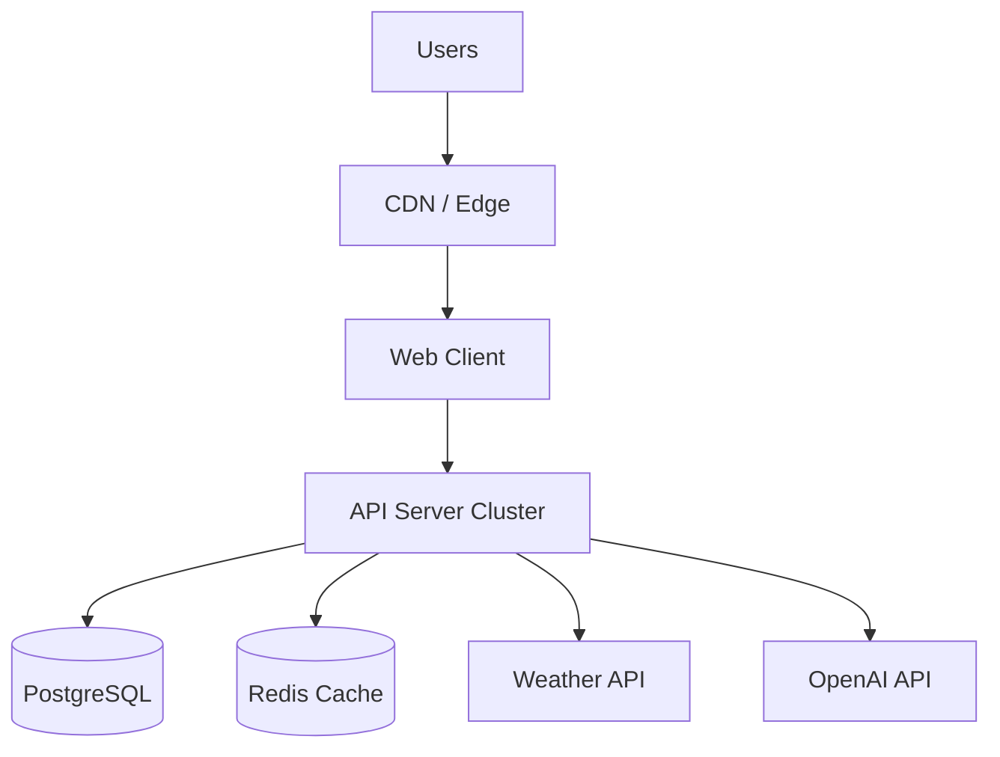
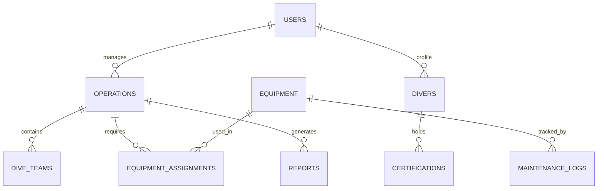
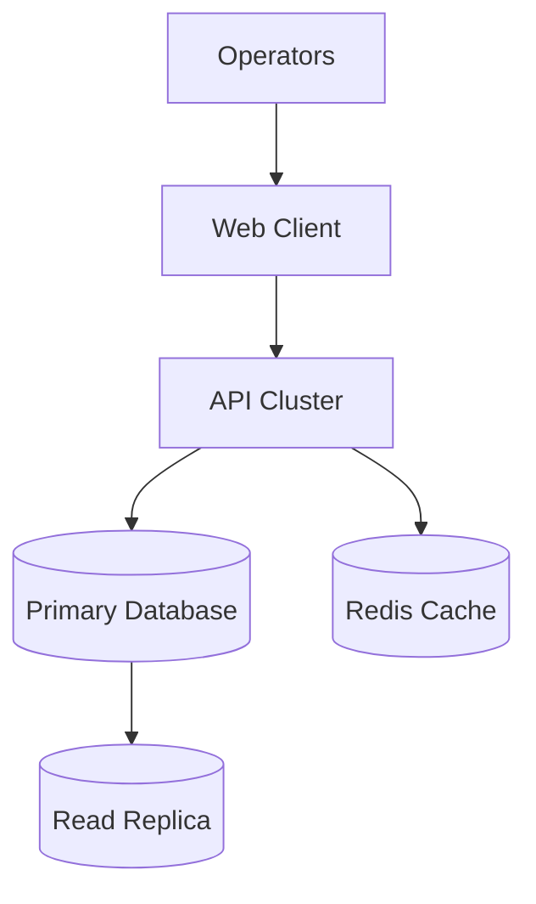
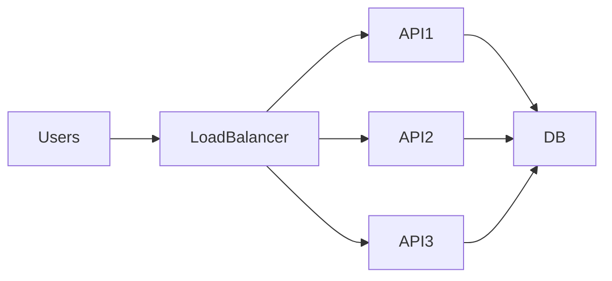
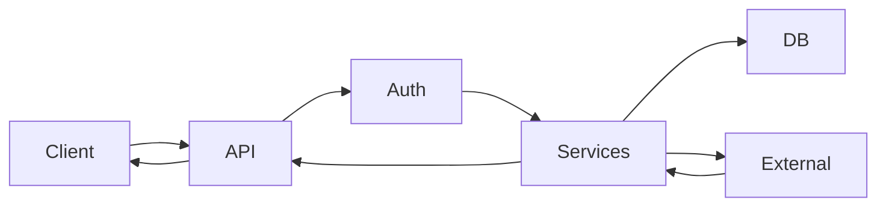
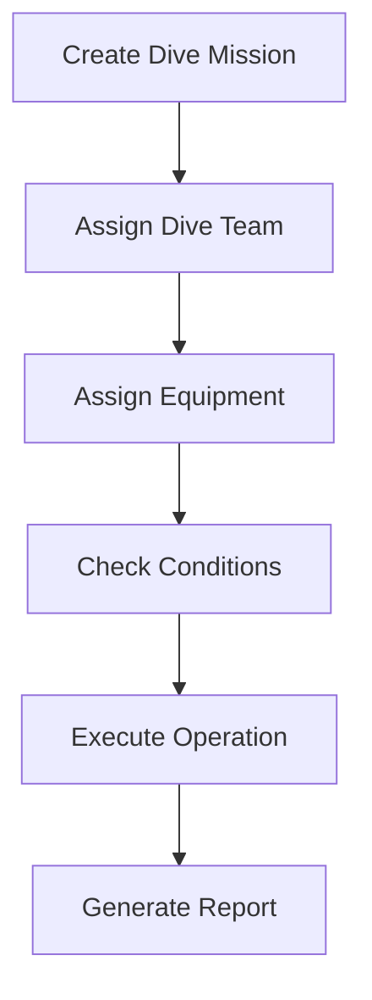

<p align="center">

</p>

<h1 align="center">DiveOps</h1>

<p align="center">
<strong>Operational Command Platform for Commercial Diving Teams</strong>
</p>

<p align="center">
DiveOps transforms dive operations into a <strong>real-time digital command center for subsea workforces.</strong>
</p>

<p align="center">


</p>

---

# Why DiveOps Exists

Commercial diving operations operate in **high-risk, coordination-heavy environments** where operational clarity directly impacts safety and mission success.

Most dive teams still rely on:

* spreadsheets
* whiteboards
* paper dive logs
* disconnected tools

These workflows create serious problems:

* fragmented operational awareness
* lost operational history
* difficult compliance reporting
* limited decision support
* poor equipment traceability

DiveOps replaces these with a **centralized digital operational backbone for subsea teams.**

The long-term vision is to build the **operating system for subsea operations worldwide.**

---

# Platform Overview

<table>
<tr>
<td width="33%">

### Operations Management

Plan and coordinate dive missions with full operational visibility.

• mission planning
• team assignment
• vessel coordination
• operational dashboards

</td>
<td width="33%">

### Personnel Management

Track diver readiness and certifications.

• diver profiles
• medical clearance tracking
• crew availability
• certification verification

</td>
<td width="33%">

### Equipment Management

Maintain full equipment lifecycle visibility.

• inventory tracking
• mission assignments
• maintenance tracking
• readiness status

</td>
</tr>

<tr>
<td width="33%">

### Environmental Intelligence

Operational awareness powered by live weather data.

• forecasts
• dive conditions
• environmental planning

</td>
<td width="33%">

### Operational Reporting

Generate structured operational records.

• dive logs
• mission reports
• equipment usage summaries

</td>
<td width="33%">

### AI Operational Assistant

AI-powered support for operations teams.

• report summarization
• operational insights
• documentation assistance

</td>
</tr>
</table>

---

# System Context



---

# Container Architecture



---

# Component Architecture



---

# Deployment Architecture



---

# Observability Stack

DiveOps includes a **production-grade monitoring stack**.

| Component      | Tool               |
| -------------- | ------------------ |
| Logging        | Pino               |
| Metrics        | Prometheus         |
| Visualization  | Grafana            |
| Error Tracking | Sentry             |
| Health Checks  | Express middleware |

Operational endpoints

```
/metrics
/healthz
```

---

# Database Model



---

# API Documentation

Base URL

```
/api
```

### Authentication

```
POST /api/auth/login
POST /api/auth/logout
GET  /api/auth/session
```

### Divers

```
GET /api/divers
POST /api/divers
GET /api/divers/:id
PUT /api/divers/:id
```

### Equipment

```
GET /api/equipment
POST /api/equipment
PUT /api/equipment/:id
```

### Operations

```
GET /api/operations
POST /api/operations
GET /api/operations/:id
PUT /api/operations/:id
```

### Weather

```
GET /api/weather/current
GET /api/weather/forecast
```

---

# Reliability Architecture



Key reliability features

* stateless API services
* database replication
* container orchestration
* caching layer

---

# Scalability Model



| Layer    | Strategy           |
| -------- | ------------------ |
| Web      | CDN distribution   |
| API      | horizontal scaling |
| Database | read replicas      |
| Caching  | Redis cluster      |

---

# Security Model

DiveOps includes multiple security layers.

### Authentication

* session authentication
* role-based access control

### Data Protection

* TLS encryption
* encrypted secrets

### Operational Security

* audit logging
* access control policies

---

# System Design Deep Dive

## Request Lifecycle



---

## Operational Event Flow



---

# Development

Clone repository

```
git clone https://github.com/spittman-maker/DiveOps-MVP.git
cd DiveOps-MVP
```

Install dependencies

```
npm install
```

Create environment file

```
cp .env.example .env
```

Run development servers

```
npm run dev
npm run dev:client
```

Application runs at

```
http://localhost:5000
```

---

# Testing

Run tests

```
npm run test
```

Run coverage

```
npm run test:coverage
```

---

# Deployment

Docker example

```
docker build -t diveops .
docker run -p 5000:5000 diveops
```

Supported environments

* Docker
* AWS ECS
* Kubernetes
* VPS

---

# Roadmap

Planned platform expansions

* mobile dive operations app
* dive computer integrations
* fleet management
* predictive equipment maintenance
* regulatory compliance automation
* AI operational copilots
* subsea analytics

---

# Organization

**Precision Subsea Group LLC**

Commercial diving technology platform.

---

# License

MIT
Patent Pending 
Trademark
